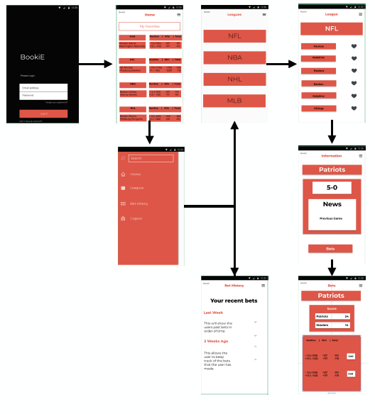
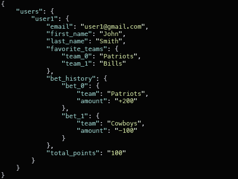
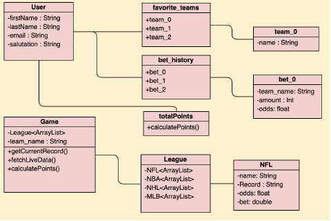

# BookiE
Sports betting simulation application for the android operating system

# Overview
BookiE was built by a small team of 3 University Students. The project satisfied the final project requirement for our CS201 Mobile Software Engineering Course. 

You can view the full project poster [here!](images/BookiEPoster.pdf)

# Abstract
BookiE is a mobile application for the Android operating system which is focused on allowing users to place bets with no money involved. BookiE is completely free and allows people to experience sports betting without the fear of losing money. Inside the application, users can login and keep track of their wins and losses. BookiE provides access to four leagues, the MLB, NBA, NHL and NFL. These are the most popular leagues in the United States and we are going to provide the user with information about each team in every league, as well as the betting odds for each game that is played. This allows the user to access all information in one central application.

# Background
Sports betting is being legalized in more and more states and will soon be a very popular activity. Growing by 50% last year, people are going to be looking for an easier way to access the data on these games. We have decided to focus on a younger audience and smartphone platform. This is because sports betting is becoming increasingly more popular in relation to smartphone usage and because of this it is targeted at younger people since they are more tech savvy. One of our goals is to make the app very easy to view information and navigate to different pages. This is because research has shown that current betting sites offer crisp graphics and display organized information are becoming increasingly popular. With all that being said we know how betting is going to become very popular very soon, so our idea of a starter app for people who want to get involved before they start using real money will be much needed for these new betters who want to try it out beforehand.

# High Fidelity Wireframe
The high fidelity wireframe gives an outline for which screens navigate to each other. We have a login screen so the users can create profiles which will be important for saving data. Once the user is logged in they are immediately brought to the home screen which is built so it shows all of the users favorite teams. The user can now open up the navigation drawer where they can access any screen. The League screen has a list of the four leagues we offer and each leads to a list of all the teams in that league. From there you can access the information page for any team, this shows basic information such as record or score of current game. From there the user can click to see if there are any bets for the team, if they chose to, they can pick a bet type and it will be added to the bet history screen which shows the history of bets for that user as well as a total points calculated from a total of wins and losses.

# Data Management
BookiE uses data from two APIs. The first being the Odds API which fetches a JSON file for any team including the betting odds for each type of bet for that specific game. The second is the MySportsFeed API which also fetches a JSON file for all sports information for each team we offer. Each user has custom account allowing them to save information.This information will be stored in a firebase database which will save users favorite teams, past bets, and total points. The rest of the application information will be filled in from the two APIs listed above.

# Database Design
The database design is simple, where we have a Users object at the root, which will consist of all the users at the next level. Inside each user is six objects such as email, name, favorite teams, bets and total points. Inside favorite_teams and bet_history consists of values for that particular object. The only three things that are specific for each user are the favorited teams, so we can populate the home screen with the teams selected. The next is the users bet history so we can keep track of the final value which is total points, which is the amount of “Money” the user would have won or lost.

# Class Implementation

# Clients
Our target market is the ever growing sports betting market, specifically but not limited to young adults. These are people who are heavily invested in sports and interested in betting on them. The app will provide this opportunity for them to be able to keep up with the statistics for their favorite teams as well as placing bets and tracking their points, without the worry of losing money. We two potential clients to address some key features in the production of our application. One of the features was customization. Our app allows you to pick favorite teams which adds them to your home screen so you can easily follow them and their bets for that day. Another feature we implemented was providing general information about each team we allow betting for. This was important to the clients because the platforms available are strictly offering bet and odds information for each team.

# Conclusion
In conclusion we are very excited about the production of the application and have some future work plans such as implementing a payment feature for users to eventually able to contact a bookie. 

